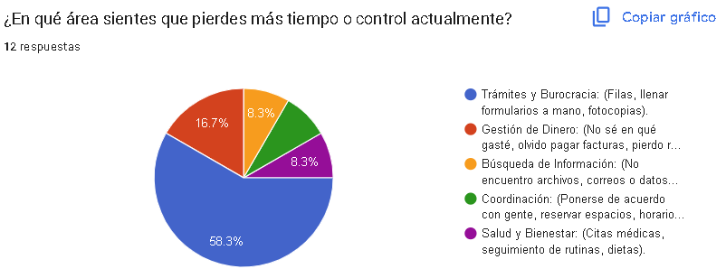
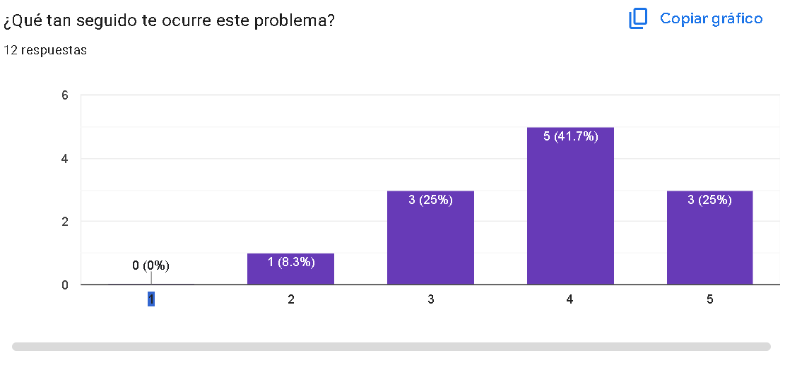

# Proyecto: Organizador de Trámites y Burocracia

### 1) Dolor principal detectado
- **¿Qué duele?:** “Tuve que ir a varias oficinas para radicar un documento, me pidieron fotocopias y formatos distintos, y al final me devolvieron por un dato mal diligenciado. Perdí casi toda la mañana en filas y vueltas.”
- **Frecuencia:** Problema recurrente (la mayoría reporta que ocurre entre 3 y 4/5).
- **Solución soñada:** “Que me diga qué necesito antes de salir, que me ayude a llenar formularios sin errores, que permita adjuntar documentos digitales y que me avise si falta algo o cambió el estado del trámite.”

### 2) Resultados de la sonda
**Encuesta de Optimización de Procesos**

- **Resumen:** El área más marcada fue Trámites y Burocracia (58.3%). Los motivos más repetidos fueron filas, diligenciamiento manual, fotocopias, repetición de datos y rechazos por requisitos incompletos. En menor medida apareció Gestión de Dinero (16.7%) y otras categorías con porcentajes más bajos.

- **Enlace al formulario:** *(https://docs.google.com/forms/d/e/1FAIpQLSdsqLq8m7KpJSQFNcgZWjVnFh3mb-J15w0DxXj-z19sHMKkkA/viewform)*

---

## Definición de Requisitos 

### 1) Historia de usuario
Como estudiante/ciudadano que realiza trámites, quiero una guía paso a paso con requisitos claros y validación de formularios antes de radicar, para evitar reprocesos, filas innecesarias y pérdida de tiempo por errores o documentos faltantes.

### 2) Criterios de aceptación
1. La solución debe funcionar correctamente en celular y computador (responsive).
2. No se debe permitir “Enviar/Radicar” si faltan requisitos obligatorios o si hay campos inválidos.
3. Al finalizar, el sistema debe generar una confirmación y un comprobante/radicado visible y descargable.
4. El usuario debe poder consultar el estado del trámite (pendiente / en revisión / aprobado / rechazado).

### 3) Requisitos funcionales 
- **RF-01: Selección de trámite y checklist automático**  
  El usuario elige el tipo de trámite y el sistema genera un checklist con documentos, pasos y requisitos obligatorios.

- **RF-02: Formulario guiado con validación**  
  El sistema permite diligenciar formularios y valida campos obligatorios y formatos (documento, correo, fechas) antes de radicar.

- **RF-03: Carga y control de anexos digitales**  
  El usuario adjunta documentos (PDF/imagen) y el sistema verifica formato/tamaño y confirma que no falten anexos requeridos.

- **RF-04: Radicado y seguimiento del estado**  
  Al enviar, el sistema genera un código de radicado, guarda el registro y permite consultar el estado e historial del trámite.
